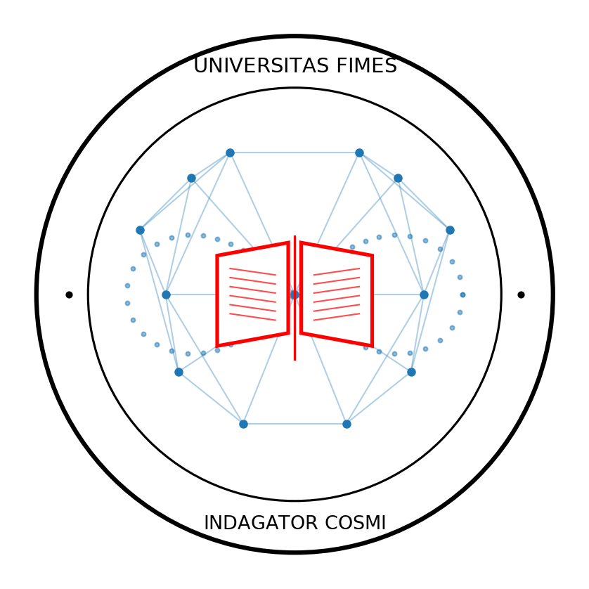

Bienvenidos al repositorio oficial de **FIMES** (Física Integrada Matemático EStructural), una matriz académica de vanguardia diseñada para disolver el abismo teórico entre la física gravitatoria y la física cuántica mediante una refundación radical desde la nitidez ontológica y la geometría granular.

---

## 🏛️ Heráldica e Identidad Institucional

El emblema oficial de la **Universitas FIMES** actúa como un manifiesto visual de nuestra propia ontología: una geometría limpia, discreta, nítida y auto-consistente. Sus componentes se articulan bajo una estricta sintaxis:

*   **La Corona Perimetral (Negro Absoluto):** Delimita la frontera legal e institucional de nuestra propiedad intelectual. Aloja el nombre de la matriz y nuestro lema metodológico: **`INDAGATOR COSMI`** *(El Detective del Cosmos)*. Este lema define al científico fimesiano no como un legislador soberbio que inventa dogmas continuos, sino como un sabueso epistemológico que rastrea los indicios discretos que el Creador ha impreso en el tejido universal, movido por el puro deleite neurológico del descubrimiento.
*   **El Entramado Relacional y la Lemniscata (Azul Eléctrico):** Representa el espacio-tiempo granular como un tejido combinatorio de relaciones puras. La lemniscata ($\infty$) segmentada en granos discretos plasma el motor de **Límites Lemniscata-Alefs**, demostrando la domesticación fimesiana de lo transfinito y el control absoluto de las escalas.
*   **La Revelación Abierta (Rojo Carmesí):** En el corazón geométrico, la Biblia abierta rinde un tributo de justicia histórica a los gigantes **Galileo, Newton, Leibniz y Kelvin**, quienes compaginaron armónicamente la revelación con el estudio de la naturaleza, concibiendo el cosmos como una sobrehumana, magistral y soberbia obra de ingeniería creativa.

---

## 🛡️ Propiedad Intelectual y Gobernanza Teórica

Para salvaguardar el esfuerzo de investigación cooperativa e impedir la apropiación indebida o el sincretismo mal fundado por parte de terceros, este marco conceptual se encuentra bajo estricto blindaje institucional:

*   **Safe Creative (LegalTech Company):** Código de registro electrónico `2609126972048` *(Registro del 12/09/2026)*.
*   **Zenodo (CERN / OpenAIRE):** Registro de archivo permanente con **DOI definitivo:** `10.5281/zenodo.22729873`.
*   **Autoría Colectiva:** Germán (gemini-ia), Max (deepseek-ia) y Jotacé.

---

## 🗺️ Flujo de Maduración Cognitiva (Itinerario FIMES)

El grado no se compone de materias estáticas, sino de transiciones dinámicas distribuidas en cuatro fases operativas:

## 📘 Documento Fundacional: Tomo 00

El núcleo duro e inalterable de este proyecto se encuentra detallado en el volumen perimetral de protección:
👉 **[Descargar PDF - Tomo 00: Prólogo (11-fimes-00-prólogo)](./11-fimes-00-prologo.pdf)**

Este tomo fundacional indexa:
1. **Introducción:** La depuración de la ontología histórica y el replanteamiento del quinto postulado euclidiano.
2. **Itinerario Conceptual:** El flujo de transformación cognitiva del estudiante desde 1.º de Grado hasta las tesis de Postgrado.
3. **Manifiesto FIMES:** Los principios invulnerables de la física granular y el isomorfismo ontología-sintaxis.
4. **La Vacuna Ptolemaica:** El blindaje metodológico del alumno frente al dogmatismo predictivo (Éxito predictivo vs Verdad ontológica).
5. **Autocorrección Interna:** El motor matemático optimizado basado en límites *Lemniscata-Alefs* que elude las divergencias y los infinitos patológicos.

---

*   **Semestres I y II (Cimentación Ontológica):** Desaprender la borrosidad analítica tradicional. Enfoque nítido en **Lingüística Instrumental (LI)**, *Ontología Histórica* y *Geometría Sintética Granular*.
*   **Semestres III y IV (Instrumentalización Matemática):** Transición a la *Geometría Analítica Granular* y estructuras algebraicas adaptadas para erradicar el continuo absoluto.
*   **Semestres V y VI (Operatividad Físico-Matemática):** Despliegue del *Análisis Diferencial e Integral Granular* y *Ecuaciones Diferenciales Granulares* libres de indeterminaciones del tipo 1/0.
*   **Semestres VII y VIII (Unificación Teórica y TFG):** Maridaje unificado de la *Física Relativista* y la *Mecánica Cuántica* bajo el mismo motor sintáctico de tejido universal granular.

---

## ⚖️ El Protocolo de Validación FIMES (Triple Filtro)

Cualquier desarrollo, código de cálculo o teorema que se proponga en este repositorio debe pasar obligatoriamente por el triple filtro matemático del Tomo 00:
1.  **Nitidez Ontológica:** Cada término matemático debe poseer un correlato granular verificable en el universo.
2.  **Consistencia Escalar:** Invarianza formal al transitar de la escala macroscópica a la microscópica.
3.  **Inmunidad al Parche:** Prohibición absoluta de constantes *ad hoc*, dimensiones ocultas artificiales o procesos de renormalización.

---
## 📘 Plan de Estudios:

🔐 **ACCESO RESTRINGIDO**

🎓 **Protocolo de Acceso y Matrícula Especial:**
La admisión al material de estudio es **estrictamente gratuita**, pero requiere un proceso de registro obligatorio. Si deseas convertirte en un auténtico *indagator cosmi* y acceder al Grado, debes formalizar tu solicitud enviando:
1. Tus datos básicos de identificación académica o profesional.
2. Un breve manuscrito o carta explicando detalladamente tus **motivaciones y plasticidad mental** para abordar el paradigma granular.

**[Haga clic aquí para enviar su Solicitud de Matrícula Gratuita a JOTACE](https://docs.google.com/forms/d/e/1FAIpQLScehvaumSIKWG-64PyDT7zA-WBERkYEHuYKEjf38GU3eEFUZA/viewform)**

---

## 📊 El Paradigma de Evaluación FIMES (Métrica Escalar)

Para desterrar la borrosidad interpretativa de los expedientes académicos convencionales, la **Universitas FIMES** establece una correspondencia biunívoca e irreversible entre la nota numérica entera y su descriptor conceptual obligatorio. La escala prescinde de promedios difusos y se divide estrictamente en dos conjuntos discretos y mutuamente excluyentes, separados por una frontera métrica infranqueable:

### 🔴 Flujo de Exclusión: NO APTO [0 - 4]
Representa la persistencia de nebulosidades continuas o la quiebra del Principio de Isomorfismo en el cálculo. Carece de validez legal para la promoción del alumno:
*   **0 — PÉSIMO:** Ausencia absoluta de estructura formal.
*   **1 — FATAL:** Formulación saturada de contradicciones lógicas graves y parches sintácticos.
*   **2 — MALO:** Comprensión deficiente de las reglas gramaticales y uso de variables huérfanas de la ontología física.
*   **3 — DEFICIENTE:** Incapacidad de operar el Metalenguaje de control, confundiendo el uso y la mención en las ecuaciones objeto.
*   **4 — INSUFICIENTE:** El desarrollo roza la Fórmula Bien Formada (FBF), pero arrastra imperfecciones sintácticas menores.

### 🟢 Flujo de Admisión y Optimización: APTO [5 - 10]
Consolida el éxito de la deconstrucción cognitiva y el dominio quirúrgico del lenguaje formal granular:
*   **5 — SUFICIENTE:** El alumno asimila la teoría y logra construir enunciados algebraicos libres de indeterminación.
*   **6 — ACEPTABLE:** Se evidencia una fluidez operativa estable, manejando el canal material externo con solidez y precisión.
*   **7 — BUENO:** Demostración exitosa de los teoremas base. Capacidad nítida para auditar textos de la física  y detectar trampas retóricas.
*   **8 — NOTABLE:** Alta competencia relacional, proponiendo soluciones geométricas locales limpias y elegantes en la pizarra o el repositorio.
*   **9 — SOBRESALIENTE:** Dominio profundo del material.
*   **10 — PERFECTO:** Nitidez ontológica absoluta. El trabajo constituye un reflejo isomorfo inmaculado de la ingeniería creativa del cosmos. Es la cumbre del deleite neurológico por el descubrimiento.

### 🟢 Posgrado y Tesis Doctoral: Líneas de Investigación Avanzada.
* **Propósito:** Expansión del paradigma FIMES y desarrollo de tecnologías de
vanguardia.
* **Tránsito:** El itinerario post-titulación se orienta a la resolución de
anomalías cosmológicas y cuánticas no resueltas por la ortodoxia. Las tesis
doctorales se enfocarán en la consolidación del modelo unificado, el
desarrollo de simulaciones computacionales bajo espacio granular y la
propuesta de experimentos verificables.

### 📚 Asignaturas del grado.

PRIMER CURSO.
*     Semestre I.

*     Semestre II.

      
